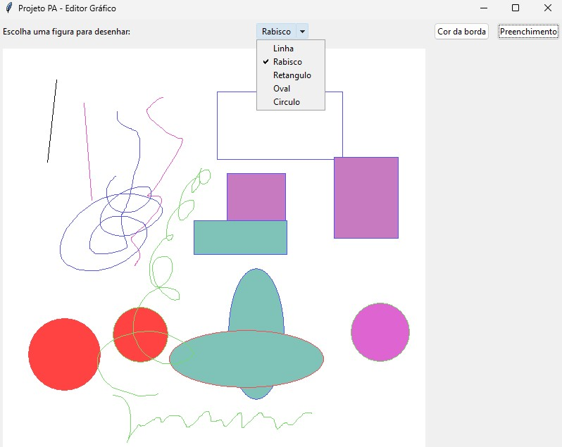

# Projeto PA - Editor Gráfico

Projeto desenvolvido para a disciplina de Programação Avançada utilizando Python e Tkinter.

## Funcionalidades

- Desenhar linhas
- Desenhar rabiscos
- Desenhar retângulos
- Desenhar ovais
- Desenhar círculos
- Escolher a cor da borda
- Escolher a cor de preenchimento

## Tecnologias utilizadas

- Python 3
- Tkinter
- Git
- GitHub

## Como executar

Clone o repositório:

```bash
git clone URL_DO_REPOSITORIO
```

Entre na pasta:

```bash
cd Projeto-PA
```

Execute:

```bash
python 03-linhasERabiscos.py
```

ou

```bash
py 03-linhasERabiscos.py
```

## Integrantes

- Marcelo de Jesus Menezes
- Murilo de Santana

## Demonstração


